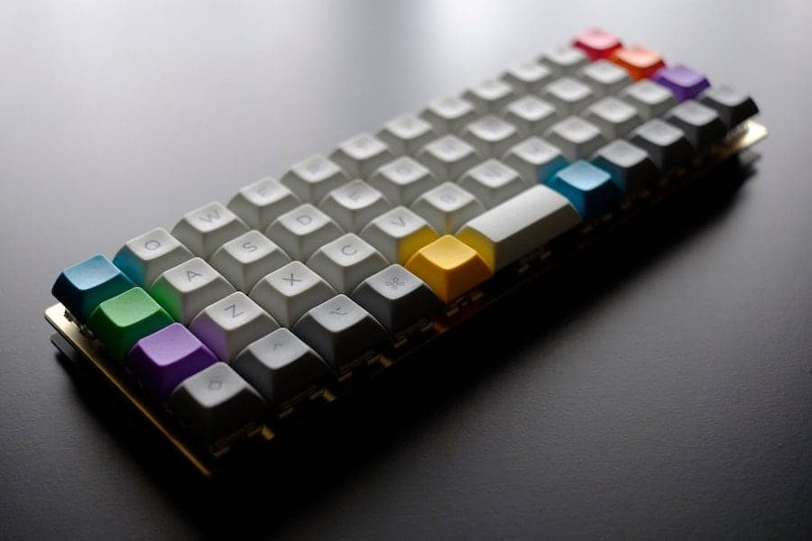

# My own Planck keymap

This is my simple keymap for my [Planck](https://olkb.com/planck) keyboard, obviously running the awesome [QMK Firmware](https://qmk.fm).



> My baby... Planck EOWT with Kailh Box Royal and cheap DSA keycaps from KDBFans


## Build

The firmware is built automatically on every version-tagged commit (like `v1.0.1`) by a GitHub Action.

Download the firmware from [`git.io/planck-biosan`](https://git.io/planck-biosan) or from the [releases page](https://github.com/biosan/planck-keymap/releases).


### Build locally

1. Clone the repository
    ```
    git clone https://github.com/biosan/planck-keymap
    ```

2. Make sure to have Docker installed and running

3. Run the build script inside the repository
    ```
    cd planck-keymap
    ./build.sh
    ```
    > **NOTE:** The firmware binary will be inside the `binary` folder

4. Flash the firmware using [QMK Toolbox](https://qmk.fm/toolbox)


## Thanks

- [Jack Humbert](https://jackhumbert.com) for designing the Planck keyboard and the QMK firmware.
- All QMK [contributors](https://github.com/qmk/qmk_firmware/graphs/contributors) and [maintainers](https://github.com/qmk/qmk_firmware#maintainers) for making this firmware so awesome.
- [r/MechanicalKeyboards](https://www.reddit.com/r/MechanicalKeyboards) for the continuous inspiration.


## License

This project is licensed under the [WTFPL license](https://choosealicense.com/licenses/wtfpl).

